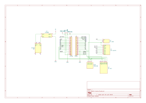

# HabitTracker

A handheld habit tracking device with reminders, built with Arduino Nano, OLED display and RTC module.

## Hardware
- MCU: Arduino Nano (ATmega328P)
- Display: SSD1306 128×64 I2C
- RTC: DS3231 (ZS-042)
- Input: 5D Joystick module (7 buttons)
- Buzzer: KY-006
- Power: TP4056 + MT3608 boost converter

## Schematic

## Firmware
Arduino (C++)

### Build
Open `Habit_Tracker/Habit_Tracker.ino` in Arduino IDE and upload to Arduino Nano.

## License
- Firmware: [MIT](LICENSE)
- Hardware: [CERN OHL-S v2](LICENSE.hardware)
